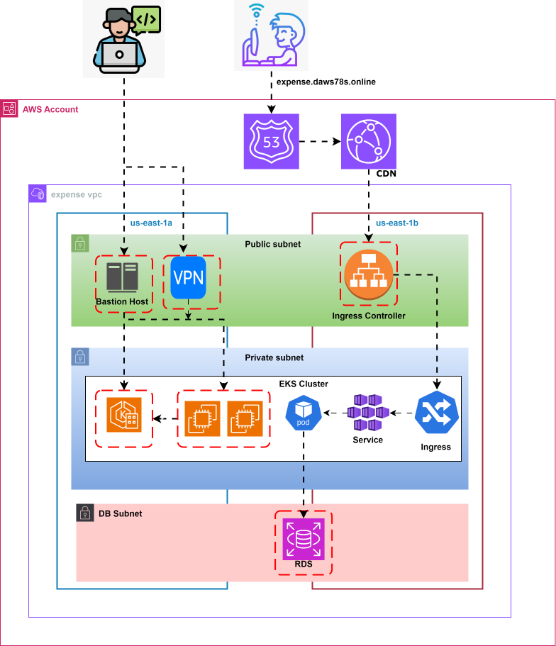

# How to delete unnecessary files: 

```
for d in 00-vpc/ 10-sg/ 20-db/ 30-bastion/ 40-eks/ 50-acm/ 60-ingress-alb/ 70-ecr/ ; do
  echo "Removing from $d:"
  echo "  $d/.terraform"
  echo "  $d/.terraform.lock.hcl"
  rm -rf "$d/.terraform" "$d/.terraform.lock.hcl"
  echo "deleted files from $d"
done
```


# Infrastructure creation and deletion

```
for i in 00-vpc/ 10-sg/ 20-db/ 30-bastion/ 40-eks/ 50-acm/ 60-ingress-alb/ ; do cd $i ;terraform init -reconfigure; cd .. ; done ;
```
```
for i in 00-vpc/ 10-sg/ 20-db/ 30-bastion/ 40-eks/ 50-acm/ 60-ingress-alb/ ; do cd $i; terraform plan; cd .. ; done 
```
```
for i in 00-vpc/ 10-sg/ 20-db/ 30-bastion/ 40-eks/ 50-acm/ 60-ingress-alb/; do cd $i; terraform apply -auto-approve; cd .. ; done 
```
```
for i in 60-ingress-alb/ 50-acm/ 40-eks/ 30-bastion/ 20-db/ 10-sg/ 00-vpc/; do cd $i; terraform destroy -auto-approve; cd .. ; done 
```

# Infrastructure



Creating above infrastructure involves lot of steps, as maintained sequence we need to create
* VPC
* All security groups and rules
* Bastion Host, VPN
* EKS
* RDS
* ACM for ingress
* ALB as ingress controller
* ECR repo to host images
* CDN

## Sequence

* (Required). create VPC first
* (Required). create SG after VPC
* (Required). create bastion host. It is used to connect RDS and EKS cluster.
* (Optional). VPN, same as bastion but a windows laptop can directly connect to VPN and get access of RDS and EKS.
* (Required). RDS. Create RDS because we don't create databases in Kubernetes.
* (Required). ACM. It is required to get SSL certificates for our ALB ingress controller.
* (Required). ingress ALB is required to expose our applications to outside world.
* (Required). ECR. We need to create ECR repo to host the application images.
* (Optional). CDN is optional. but good to have.

### Admin activities

**Bastion**
* SSH to bastion host
* run below command and configure the credentials.
```
aws configure
```
* get the kubernetes config using below command
```
aws eks update-kubeconfig --region us-east-1 --name expense-dev
```
* Now you should be able to connect K8 cluster
```
kubectl get nodes
```
Create a namespace
```
kubectl create namespace expense
```
**RDS**:
* Connect to RDS using bastion host.
```
mysql -h db-dev.lithesh.shop -u root -pExpenseApp1
```
* We are creating schema while creating RDS. But table should be created.
* Refer backend.sql to create
    * Table
    * User
    * flush privileges

```
USE transactions;
```
```
CREATE TABLE IF NOT EXISTS transactions (
    id INT AUTO_INCREMENT PRIMARY KEY,
    amount INT,
    description VARCHAR(255)
);
```
```
CREATE USER IF NOT EXISTS 'expense'@'%' IDENTIFIED BY 'ExpenseApp@1';
```
```
GRANT ALL ON transactions.* TO 'expense'@'%';
```
```
FLUSH PRIVILEGES;
```

# Important Note: We no need to attach this this policy ‘ElasticLoadBalancingFullAccess’ to EKS Worker node's IAM role and execute it.  It will be attached automatically when eks nodes are created.


**Ingress Controller**

Ref: https://kubernetes-sigs.github.io/aws-load-balancer-controller/v2.8/
* Connect to K8 cluster from bastion host.
* Create an IAM OIDC provider. You can skip this step if you already have one for your cluster.

# IAM OIDC Setup:
```
eksctl utils associate-iam-oidc-provider --region us-east-1 --cluster expense-dev --approve
```

# Create IAM Policy:
* Download an IAM policy for the LBC using one of the following commands:
```
curl -o iam-policy.json https://raw.githubusercontent.com/kubernetes-sigs/aws-load-balancer-controller/v2.8.2/docs/install/iam_policy.json
```

* Create an IAM policy named AWSLoadBalancerControllerIAMPolicy. If you downloaded a different policy, replace iam-policy with the name of the policy that you downloaded.
```
aws iam create-policy --policy-name AWSLoadBalancerControllerIAMPolicy --policy-document file://iam-policy.json
```

# (Optional) Use Existing Policy:
```
aws iam list-policies --query "Policies[?PolicyName=='AWSLoadBalancerControllerIAMPolicy'].Arn" --output text

```

# Create IAM Service Account:
* Create a IAM role and ServiceAccount for the AWS Load Balancer controller, use the ARN from the step above

```
eksctl create iamserviceaccount \
--cluster=expense-dev \
--namespace=kube-system \
--name=aws-load-balancer-controller \
--attach-policy-arn=arn:aws:iam::805778285734:policy/AWSLoadBalancerControllerIAMPolicy \
--override-existing-serviceaccounts \
--region us-east-1 \
--approve
```

# Install Helm Chart:
* Add the EKS chart repo to Helm
```
helm repo add eks https://aws.github.io/eks-charts
```

* Helm install command for clusters with IRSA:

```
helm install aws-load-balancer-controller eks/aws-load-balancer-controller -n kube-system --set clusterName=expense-dev
```

* Option 1 (Recommended): Reuse Existing ServiceAccount

* Since eksctl already created the IAM service account, tell Helm not to create it again.
```
helm install aws-load-balancer-controller eks/aws-load-balancer-controller \
  -n kube-system \
  --set clusterName=expense-dev \
  --set serviceAccount.create=false \
  --set serviceAccount.name=aws-load-balancer-controller
```


# Validate:
* check aws-load-balancer-controller is running in kube-system namespace.
```
kubectl get pods -n kube-system
```

# Clone the expense app on Bastion server and run it.
git clone https://github.com/rajalingarao/9.19.expense-terraform-aws-eks-TargetGroupBinding.git

cd 9.19.expense-terraform-aws-eks-TargetGroupBinding

cd 70-expense-k8s-TGB

# Note: We will not create MySQL pod because it is already created on 20-db repository with password ExpenseApp1
```
kubectl apply -f namespace.yaml
```
```
kubectl apply -f backend/manifest.yaml
```
```
kubectl apply -f frontend/manifest.yaml
```
```
kubectl apply -f debug/manifest.yaml
```

```
kubens expense
```

```
kubectl get pods
```

# Open browser and access the application:
```
http://expense-dev.lithesh.shop:80
```

# Trouble shoot using debug manifest:

```
mysql -h expense-dev.c0d4soae2u8h.us-east-1.rds.amazonaws.com -u root -pExpenseApp1
```
or

```
mysql -h db-dev.lithesh.shop -u root -pExpenseApp1
```

```
USE transactions;
```
```
select * from transactions;
```

